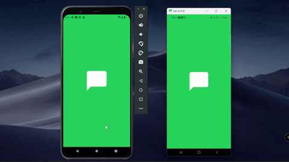
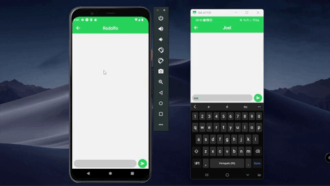

# Chat - Messaging app
This is a mobile chat app developed with React Native, Expo, Firebase, Firestore and Redux Toolkit. It has authentication features and messages are stored and updated in real-time.

## Authentication
The user can log in automatically if they have already logged in previously. The authentication forms are validated using React Hook Form and Yup, ensuring the validity of the user's data.

## Send messages
The chat system allows users to exchange messages in real-time. Messages are stored in Firestore and displayed in a real-time updated list using the onSnapshot listener. The user can send new messages at any time and view received messages without having to refresh the page.

